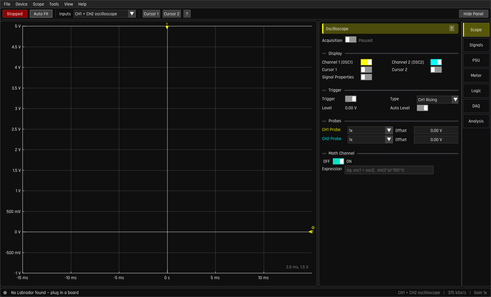

# Getting started

## What you need

* An EspoTek Labrador board
* A micro-USB cable — **it must be a data cable**, not a charge-only cable
  (charge-only cables are the single most common cause of "device not found")
* A computer (Windows, macOS, Linux), Raspberry Pi, or Android device
* For actually building circuits: a breadboard and some jumper wires

The Labrador has no power switch and no battery — it is powered entirely from
USB. Plug it in and it's on.

## Installing the software

Download the latest release for your platform from the
[releases page](https://github.com/espotek-org/Labrador/releases), or build it
yourself from `Unified_App/` (see the repository README for build
instructions).

* **Windows** — run the installer. If the board is not detected afterwards,
  see [Troubleshooting](troubleshooting.md#windows-driver-issues).
* **macOS** — open the `.dmg` and drag the app into Applications.
* **Linux / Raspberry Pi** — install the package, and make sure the udev rules
  are installed so you can access the board without root (see the repository
  README, section *udev rules*).
* **Android** — install the APK; the app asks for USB permission when you
  plug the board in with an OTG adapter.

## First connection

1. Start the Labrador app. Before you plug anything in, the status bar at the
   bottom-left reads **"No Labrador found — plug in a board"**:

   

2. Plug the board in. Within a couple of seconds the dot turns **green** and
   the status reads **"Connected — firmware 12.3"** (the number is the
   firmware version the board is running).

3. **If the app offers to update the firmware, say yes.** The board's firmware
   ships on the PC side and the app keeps the board up to date. You'll see
   *"Flashing firmware … this takes a few seconds. Do not unplug the board."*
   — let it finish. This is completely automatic and safe; the board
   reconnects by itself.

That's it. There is no setup beyond this — the scope starts acquiring as soon
as the board connects.

## A 60-second orientation

The desktop window has five areas:

* **Menu bar** (top) — `File`, `Device`, `Scope`, `Tools`, `View`, `Help`.
  `Help → Keyboard Shortcuts` (or `F1`) and `Help → User Guide` are worth
  knowing about from the start.
* **Toolbar** — the green/red **Running/Stopped** button starts and stops the
  scope (shortcut: `Space`), **Auto Fit** (`F`) rescales the graph to fit the
  signal, the **Inputs** dropdown selects what the two channels measure, and
  the **Cursor 1 / Cursor 2** buttons enable measurement cursors.
* **Plot** — the big graph. Drag to pan, scroll to zoom, double-click to
  auto-fit, drag on an axis to pan only that axis.
* **Side panel + rail** (right) — seven pages of controls: **Scope, Signals,
  PSU, Meter, Logic, DAQ, Analysis**. Click a name on the rail to open its
  page; press `B` to hide or show the whole panel.
* **Status bar** (bottom) — connection state on the left; input mode, sample
  rate and gain on the right.

On a small touchscreen (e.g. a Raspberry Pi build), the app automatically
switches to a finger-friendly **compact layout** with the same instruments:

You can force any layout from `View → Layout`.

## Safety — what the board tolerates

The Labrador is deliberately hard to kill ("idiot-proof, though not
complete-idiot-proof" per its designer):

* Shorting any two **header pins** together is safe.
* The oscilloscope inputs tolerate **−20 V to +20 V**.
* The logic analyzer inputs tolerate 3.3 V, 5 V and 12 V logic.
* Even connecting a 12 V supply directly into a digital output pin only
  sacrifices one protection resistor (repairable with a soldering iron).
* The 5 V rail is protected by a self-resetting (PTC) fuse of about 400 mA.

Two real rules:

1. **Only connect wires to the header pins around the board's edge.** Don't
   probe the bare components or microcontroller pins in the middle of the
   board with live wires.
2. **Everything is measured relative to the board's GND pin.** Connect your
   circuit's ground to Labrador's GND, or your readings will be meaningless.
   (The one exception is the multimeter, which measures *between* its two
   probe pins.)

## Next step

Work through the **[tutorial](tutorial.md)** — it takes about 20 minutes and
one jumper wire, and by the end you'll have used the signal generator, the
scope, cursors, automatic measurements, XY mode and the spectrum analyser.
