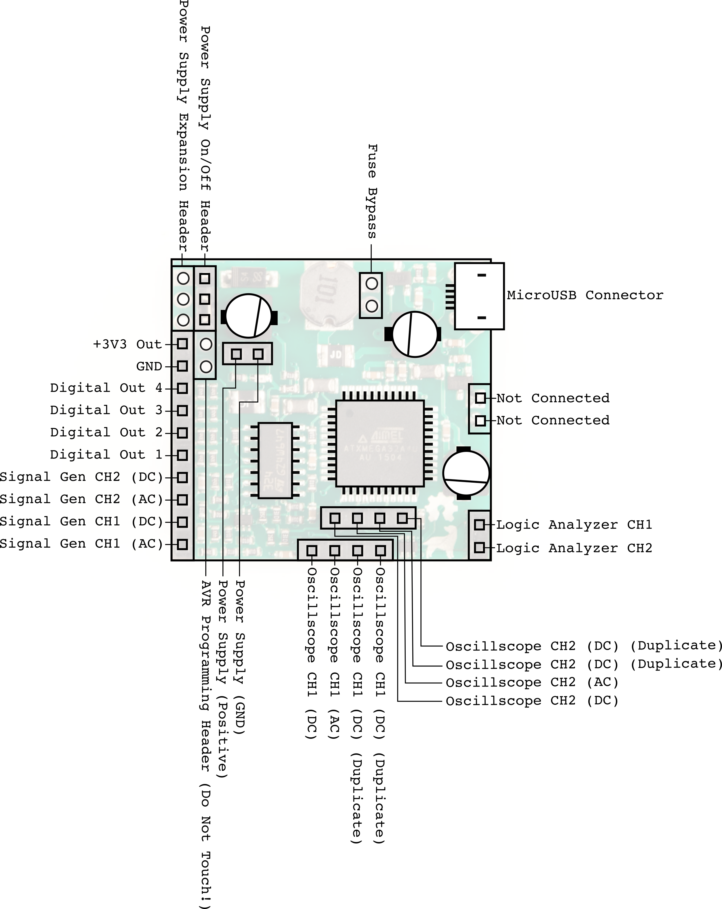
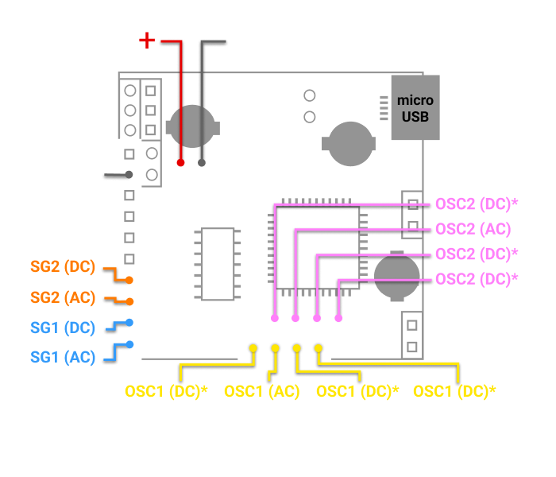

# Pinout reference

Orient the board with the **micro-USB connector at the top right** (this is
how every diagram below is drawn).

A simplified view showing just the pins you'll use most — signal generator,
oscilloscope, and power supply:

## Left-edge header (top → bottom)

| Pin | Function | Notes |
|---|---|---|
| +3V3 Out | 3.3 V supply output | Handy for powering logic |
| GND | Ground | **Connect your circuit's ground here** |
| Digital Out 4 | Digital output, 3.3 V | 50 Ω source impedance |
| Digital Out 3 | Digital output, 3.3 V | |
| Digital Out 2 | Digital output, 3.3 V | |
| Digital Out 1 | Digital output, 3.3 V | Also used to enter bootloader mode (short to GND before plugging in) |
| Signal Gen CH2 (DC) | SG2 output, DC-coupled | The one to use for most work |
| Signal Gen CH2 (AC) | SG2 output, AC-coupled | Audio / op-amp work |
| Signal Gen CH1 (DC) | SG1 output, DC-coupled | The one to use for most work |
| Signal Gen CH1 (AC) | SG1 output, AC-coupled | Audio / op-amp work |

## Bottom header (left → right): Oscilloscope CH1

| Pin | Function |
|---|---|
| Oscilloscope CH1 (DC) | CH1 input, DC-coupled — use this one by default |
| Oscilloscope CH1 (AC) | CH1 input, AC-coupled |
| Oscilloscope CH1 (DC) *duplicate* | Same node as CH1 (DC) — used by the multimeter |
| Oscilloscope CH1 (DC) *duplicate* | Same node as CH1 (DC) — used by the multimeter |

## Interior header (above the CH1 header): Oscilloscope CH2

| Pin | Function |
|---|---|
| Oscilloscope CH2 (DC) | CH2 input, DC-coupled — use this one by default |
| Oscilloscope CH2 (AC) | CH2 input, AC-coupled |
| Oscilloscope CH2 (DC) *duplicate* | Same node as CH2 (DC) — used by the multimeter |
| Oscilloscope CH2 (DC) *duplicate* | Same node as CH2 (DC) — used by the multimeter |

## Right-edge header

| Pin | Function |
|---|---|
| Not connected | — |
| Not connected | — |
| Logic Analyzer CH1 | Digital input, 3 MSa/s, tolerates 3.3 / 5 / 12 V |
| Logic Analyzer CH2 | Digital input, 3 MSa/s, tolerates 3.3 / 5 / 12 V |

## Power supply pins (interior, near the top-left screw)

| Pin | Function |
|---|---|
| Power Supply (Positive) | The programmable 4.5–11 V output |
| Power Supply (GND) | Ground return for the supply |

On a breadboard, run these to the **side power rails** rather than the main
grid, to keep accidental shorts away from your circuit.

## Top edge

| Item | Function |
|---|---|
| Power Supply Expansion Header | For hardware add-ons; not needed in normal use |
| Power Supply On/Off Header | For hardware add-ons; not needed in normal use |
| Fuse Bypass (two pins left of the USB connector) | Top pin = 5 V straight from USB, bottom pin = 5 V after the fuse. Short them together to bypass the ~400 mA self-resetting fuse. Only do this if you know why you need to. |
| Micro-USB connector | Power + data to the host |
| AVR Programming Header (bottom interior strip) | **Do not touch** — factory programming only |

## AC vs DC coupled pins

Every scope input and signal-generator output exists twice: **DC-coupled**
and **AC-coupled**.

* The **DC** pins pass the signal through unchanged. **Use these unless you
  have a specific reason not to.**
* The **AC** pins put a capacitor in series, which removes the DC (average)
  component of the signal. This is useful for audio work and for interfacing
  with dual-supply op-amp circuits, but it will *distort* square waves and
  make steady voltages read as zero — a classic beginner trap.

## Duplicate oscilloscope pins

The pins marked *duplicate* are wired to the same node as the corresponding
CH (DC) pin. They exist so the multimeter has convenient places to build its
measurement circuits (the app calls the pair **DUT+** = CH1 and **DUT−** =
CH2). For ordinary scope use you can ignore them — or use them as a second
physical connection point for the same channel.

## Electrical limits (memorise the first two)

| | Limit |
|---|---|
| Oscilloscope input range | **−20 V to +20 V**, 1 MΩ input impedance |
| Logic analyzer inputs | 3.3 / 5 / 12 V logic |
| Signal generator output | 0.15–9 V peak-to-peak, ≤ 10 mA, 50 Ω output impedance; the output ceiling also tracks the PSU setting (max ≈ PSU voltage − 1.2 V) |
| Power supply output | 4.5–11 V, ≤ 0.75 W total; ripple grows with load (≈ ±300 mV at 10 V/10 mA, ±700 mV at 10 V/100 mA) |
| Digital outputs | 3.3 V through 50 Ω |
| +3V3 Out | Shares the USB power budget (≈ 400 mA fuse for the whole board) |
| Multimeter | ±20 V; current ≈ 100 µA–10 A, resistance ≈ 1 Ω–100 kΩ, capacitance ≈ 10 nF–1 mF, all depending on your reference resistor |
