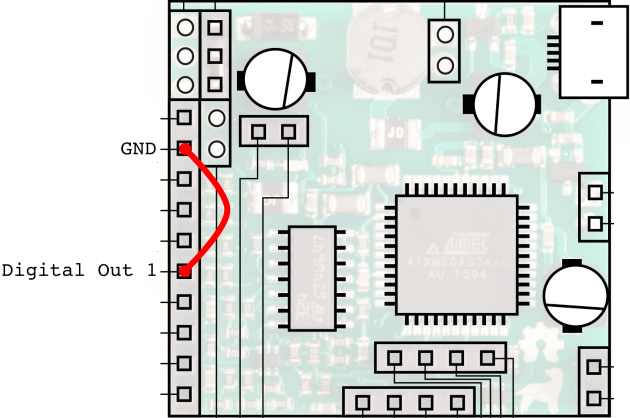

# Troubleshooting

## The board isn't detected

Work through these in order:

1. **Swap the USB cable.** Charge-only micro-USB cables have no data wires
   and are everywhere. This fixes more Labradors than everything else
   combined.
2. **Unplug everything from the board's pins**, then unplug and replug the
   USB cable twice. (A pin wired to GND during plug-in can put the board into
   bootloader mode — see below.)
3. **Give it a port of its own.** The Labrador reserves substantial USB
   bandwidth to guarantee gap-free streaming. Move it away from hubs shared
   with webcams, audio devices, keyboards and mice — ideally straight into
   the computer, or into a hub shared only with non-streaming devices
   (flash drives and the like).
4. **Raspberry Pi 4**: the USB-A ports need VL805 firmware `0138a1` or later
   — update with `sudo rpi-eeprom-update`.

### Windows driver issues

If the app installs but the board never connects, open Device Manager:

* Board listed under **libusbK USB Devices** *with a yellow triangle* — the
  driver is fine but USB bandwidth is short; see point 3 above.
* Board listed under **Other Devices** — the driver didn't install. Re-run
  the installer and make sure **both** driver checkboxes are ticked (don't
  hand-pick libusb-win32/libusb0 variants in Device Manager).
* Not listed at all — cable or bootloader mode; see points 1–2 above.

### macOS / Linux

Install libusb if the app complains (`brew install libusb` on macOS). On
Linux, make sure the udev rules are installed (see the repository README)
and replug the board — without them only root can open the device.

## Orange status: bootloader mode / flashing

**Bootloader mode** is the board's firmware-update state. It's entered
automatically during updates, or manually by shorting **Digital Out 1 to
GND while plugging the board in**.

The app handles this by itself: if it sees a board stuck in bootloader mode
it reflashes the right firmware and reconnects (status: *"Recovering board
from bootloader mode — do not unplug"*). Just wait for the green dot.

Corollary: if you deliberately put the board in bootloader mode for other
tools (e.g. `dfu-programmer`), close the Labrador app first, or it will
helpfully "rescue" your board out of it.

## "Sorry to Interrupt!" — the misconfigured-board dialog

If the app detects a board with corrupted/incompatible firmware
configuration, it shows a repair dialog asking you to:

1. Connect **Digital Out 1** to **GND** with a jumper:

   

2. Unplug and replug the USB cable, leaving the jumper in place.

The app waits for the board to reappear in bootloader mode, reflashes it,
and reports *"Board repaired and reconnected successfully."* Remove the
jumper afterwards.

## Red status: Safety mode

*"Labrador has entered Safety Mode. This can happen if the PSU voltage is set
too high."* — the board shut its supply down to protect itself (usually a
short or over-load on the PSU pin, or too much total current for USB).
Remove the load, then unplug and replug the board.

## Red status: Uninitialised state

The board enumerated but isn't producing data — this can happen when the
board powered up before the OS had USB ready (seen on some Pi setups). The
app resets the USB link automatically twice; if the status stays red, unplug
and replug the board. `Esc` (Reset USB connection) is the manual version.

## Readings look offset or scaled wrong

Run `Device → Calibration…` — two short wizards (scope, then PSU) that null
out part tolerances. See the [user manual](user-manual.md#calibration).
Also check you're not accidentally on an **AC-coupled** pin (steady voltages
read as 0 V there), and that your circuit's ground really is connected to
the board's GND pin.

## The scope trace is noisy

Some noise is normal at high gain — the board resolves millivolts over a
±20 V range with an 8-bit ADC (12-bit in single-channel and multimeter
modes). For cleaner readings: use the multimeter mode for DC measurements,
keep wires short, and prefer the 12-bit input modes when you only need one
channel.

## Manual firmware recovery (last resort)

If the app can't flash the board at all, you can do it by hand with
`dfu-programmer` (Homebrew/apt package of the same name):

```sh
# 1. Short Digital Out 1 to GND, plug the board in (bootloader mode)
# 2. Point it at the firmware hex shipped with the app:
dfu-programmer atxmega32a4u erase --force
dfu-programmer atxmega32a4u flash labrafirm_000C_03.hex
```

The `.hex` files live in the app's resources (`firmware/` next to the
executable, `labrafirm_<version>_<variant>.hex`). The microcontroller is an
ATxmega32A4U.

## Still stuck?

Search or open an issue at
[github.com/espotek-org/Labrador](https://github.com/espotek-org/Labrador/issues),
or email `admin@espotek.com` — the developer answers.
