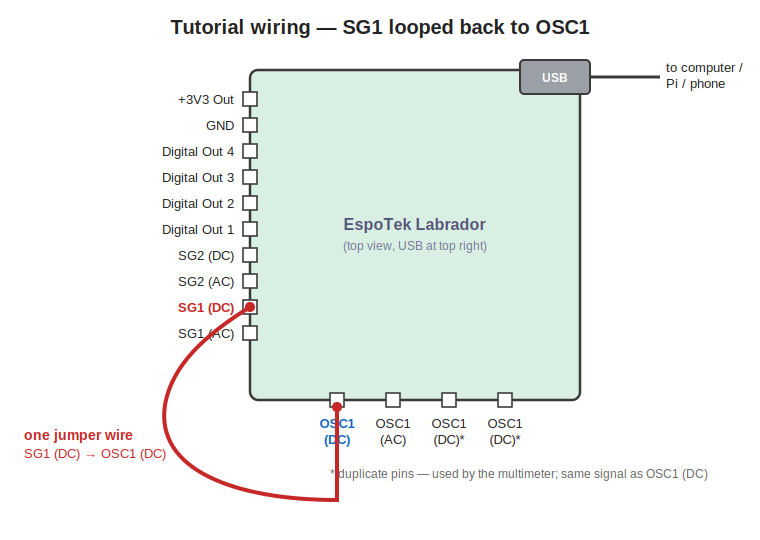
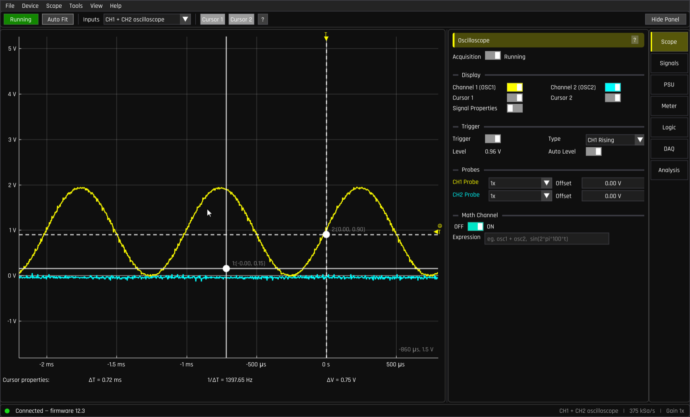
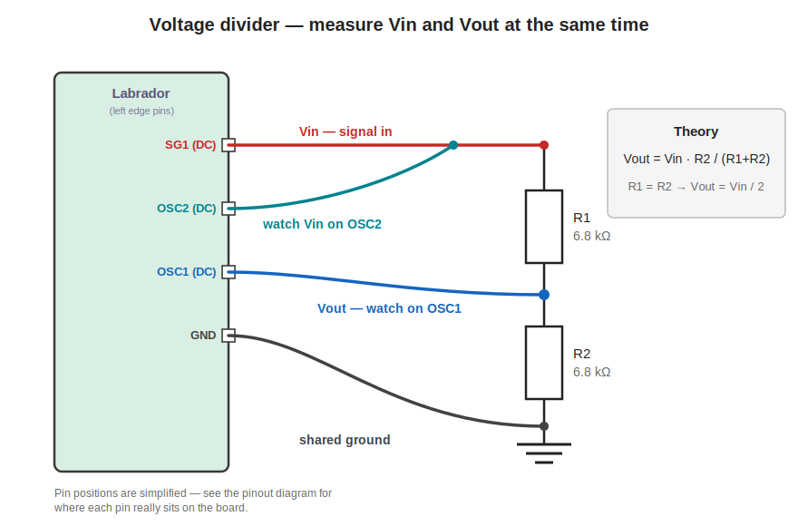

# Tutorial — your first measurements

Time: about 20 minutes.
You need: a Labrador, its USB cable, **one jumper wire** — plus a breadboard,
two more jumpers and two equal resistors (anything from 1 kΩ to 10 kΩ) for
part 2.

The idea: the Labrador contains both a **signal generator** (which *makes*
voltages that change over time) and an **oscilloscope** (which *draws*
voltages that change over time). If we wire one into the other, we can
practise every scope skill without building any circuit at all.

## Part 1 — loop the signal generator into the scope

### 1. Wire it

Connect **Signal Gen CH1 (DC)** to **Oscilloscope CH1 (DC)** with a single
jumper wire. Both pins are labelled in the [pinout reference](pinout.md);
SG1 (DC) is on the left edge, OSC1 (DC) is the leftmost pin of the bottom
header.

(No ground wire is needed here — the generator and the scope live on the same
board, so they already share a ground. When you measure an *external* circuit
you must always connect its ground to Labrador's GND pin.)

### 2. Turn on the generator

Plug the board in, wait for the green **Connected** dot, then open the
**Signals** page on the right-hand rail.

Under **Signal Generator 1**:

* flip **Power** to **ON**,
* leave the waveform as **Sine**,
* set **Vpeak-peak** to `2.0 V` and **Frequency** to `1000 Hz` — click a
  value and drag to adjust it, or double-click it to type.

### 3. See the wave

Press `F` (or click **Auto Fit** in the toolbar). You should see a yellow
sine wave, standing still:

Three things to notice, because they're the heart of how every oscilloscope
works:

* **The wave stands still because of the trigger.** The scope starts each
  sweep at the same point on the waveform — by default, when channel 1
  crosses a threshold going upward (`CH1 Rising`, see the *Trigger* section
  of the Scope page). Turn the trigger off and the wave will drift or jitter;
  that's what an untriggered scope looks like.
* **The wave sits between 0 V and 2 V, not ±1 V.** On the Labrador, a
  generator's *Vbase* setting is the **lowest point** of the wave (not its
  average). Vbase 0 + 2 V peak-to-peak = a sine from 0 V to 2 V.
* **The cyan flat line is channel 2** doing nothing (it isn't connected to
  anything, so it just shows a little noise around 0 V). You can hide it by
  pressing `V` or toggling **Channel 2 (OSC2)** on the Scope page.

Play for a minute: scroll on the plot to zoom, drag to pan, drag on an axis
to move just that axis, scroll on the plot while hovering an axis to zoom
just that axis, double-click to fit again. `Space` freezes and un-freezes the
display — while frozen you can still zoom into the *captured* record in full
detail.

### 4. Measure it with cursors

Click **Cursor 1** and **Cursor 2** in the toolbar (or press `1` and `2`).
Two crosshairs appear; drag their centre dots to two matching points on the
wave — say, two adjacent peaks. The **Cursor properties** row under the plot
shows the differences between the cursors:

* **∆T** — the horizontal (time) distance. One full cycle of a 1 kHz wave
  should be almost exactly **1 ms**.
* **1/∆T** — that time converted to a frequency. Bracket exactly one period
  and it reads ≈ **1000 Hz**.
* **∆V** — the vertical (voltage) distance. From trough to peak you should
  measure ≈ **2 V**.

This is the manual way — and it's how you'll measure *parts* of a waveform
(a pulse width, an overshoot) forever.

### 5. Let the app measure for you

Turn the cursors off and enable **Signal Properties** (Scope page → Display,
or the `Scope` menu). A table appears under the plot with the period,
frequency, peak-to-peak, min, max, average and RMS voltage of every visible
trace, continuously updated:

Check it against what you set: Freq ≈ 1000 Hz, Vpp ≈ 2 V. (A few percent off
is normal on an uncalibrated board — `Device → Calibration…` fixes that, see
the [user manual](user-manual.md#calibration).)

### 6. Two bonus views

**XY mode** (`Scope → XY Mode`): instead of voltage-versus-time, the plot
draws CH1 versus CH2. Wire a second jumper from SG2 (DC) to OSC2 (DC), turn
on Signal Generator 2 at the same frequency, and you get the classic
Lissajous figure — a circle when the two sines are 90° apart:

**Spectrum analyser** (`Tools → Spectrum Analyser`, then **Start Acquiring**
on the Analysis page): shows *which frequencies* your signal contains. A pure
1 kHz sine is a single tall spike at 1 kHz above the noise floor:

Try switching the generator to **Square** and acquiring again — you'll see
the odd harmonics (3 kHz, 5 kHz, 7 kHz…) that make a square wave square.
That's Fourier analysis, live.

## Part 2 — a real circuit: the voltage divider

Now measure something you built. A voltage divider is two resistors in
series; the voltage at their midpoint is a fixed fraction of the input:

**Vout = Vin × R2 / (R1 + R2)** — with equal resistors, Vout = Vin / 2.

### Wire it

On a breadboard, put two equal resistors (e.g. 6.8 kΩ) in series. Then
connect four wires to the Labrador:

1. **SG1 (DC)** → the top of R1 (this is Vin)
2. **OSC2 (DC)** → the same node as Vin (so you can watch the input)
3. **OSC1 (DC)** → the junction between R1 and R2 (this is Vout)
4. **GND** → the bottom of R2 — *this* is the wire beginners forget; without
   a shared ground nothing will read correctly

### Measure it

Set SG1 to a 1 kHz sine, 3 V peak-to-peak. Press `F` to fit. You should see
two sine waves: the cyan input (CH2) at 3 Vpp and the yellow output (CH1) at
half the amplitude, perfectly in phase.

Turn on **Signal Properties** and compare the Vpp rows: CH1 should be very
close to half of CH2. It won't be *exactly* half — your resistors have
tolerance (±1% or ±5%), and that difference is real, not a mistake. You've
just verified the voltage-divider equation with actual hardware.

### If something looks wrong

* **Both traces flat at 0 V** — the generator is off, or you're on the wrong
  pins (AC instead of DC?).
* **Wave visible on CH2 but CH1 is garbage/floating** — missing GND wire, or
  OSC1 isn't really on the middle node.
* **Amplitudes way off** — check you used the (DC) pins everywhere. The AC
  pins remove the DC component and will confuse this measurement.

## Where to go next

* Change the divider ratio (R1 = 1 kΩ, R2 = 10 kΩ → Vout = 10/11 Vin) and
  verify the equation still holds.
* Put a capacitor in place of R2 and sweep the frequency — you've built a
  low-pass filter. The **Network Analyser** (Analysis page) will draw its
  frequency response for you automatically.
* Read the [user manual](user-manual.md) for the multimeter, logic analyzer,
  DAQ recorder and everything else the board can do.
