# User manual — the Labrador app

This manual covers the desktop layout of the unified Labrador app. The tablet
layout is identical with bigger touch targets; the mobile and compact layouts
rearrange the same instruments for small screens (`View → Layout` switches
between them).

## The main window

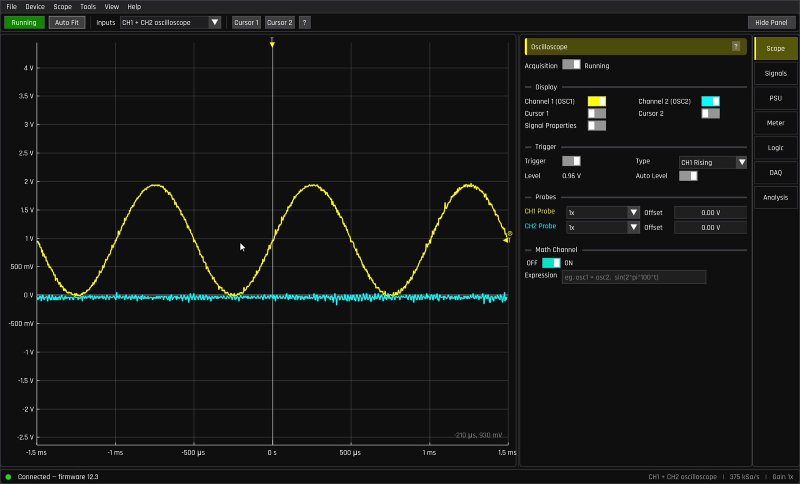

From top to bottom:

* **Menu bar** — `File`, `Device`, `Scope`, `Tools`, `View`, `Help`.
* **Toolbar** — acquisition Run/Stop, Auto Fit, the Inputs mode selector,
  cursor toggles, plot help (`?`), and Show/Hide Panel.
* **Plot** — the graph itself.
* **Side panel** (right) with its **rail** of seven pages: **Scope, Signals,
  PSU, Meter, Logic, DAQ, Analysis**. Every panel has a `?` button that opens
  context help.
* **Status bar** — connection status (left); input mode, sample rate, and
  hardware gain (right). A red **REC** appears while the DAQ is recording.

### Connection status at a glance

| Dot | Text | Meaning |
|---|---|---|
| grey | *No Labrador found — plug in a board* | Nothing detected |
| green | *Connected — firmware N.N* | Ready |
| orange | *Board in bootloader mode* / *Flashing firmware — do not unplug* | Firmware update in progress — wait |
| red | *Safety mode* / *Uninitialised state* | Unplug and replug the board ([why](troubleshooting.md#safety-mode)) |

## The plot: pan, zoom, and read values

* **Drag** anywhere to pan; drag on an axis to pan just that axis.
* **Scroll** to zoom; scroll over an axis to zoom just that axis.
* **Double-click** = auto-fit both axes (same as `F` / the Auto Fit button).
* `Ctrl`+double-click resets the plot limits entirely.
* The yellow marker on the top edge is the **trigger position**; the marker
  on the right edge is the **trigger level** — both can be dragged.

**Cursors** (`1` and `2`, or the toolbar buttons): draggable crosshairs that
display their exact (time, voltage) position. With both enabled, a *Cursor
properties* row under the plot shows **∆T**, **1/∆T** (i.e. frequency) and
**∆V** between them — the fastest way to measure a period or an amplitude by
hand.

**Signal Properties** (Scope page or `Scope` menu): a live table of Period,
Freq, Vpp, Vmax, Vmin, Vavg and Vrms for each visible channel, computed over
the visible window:

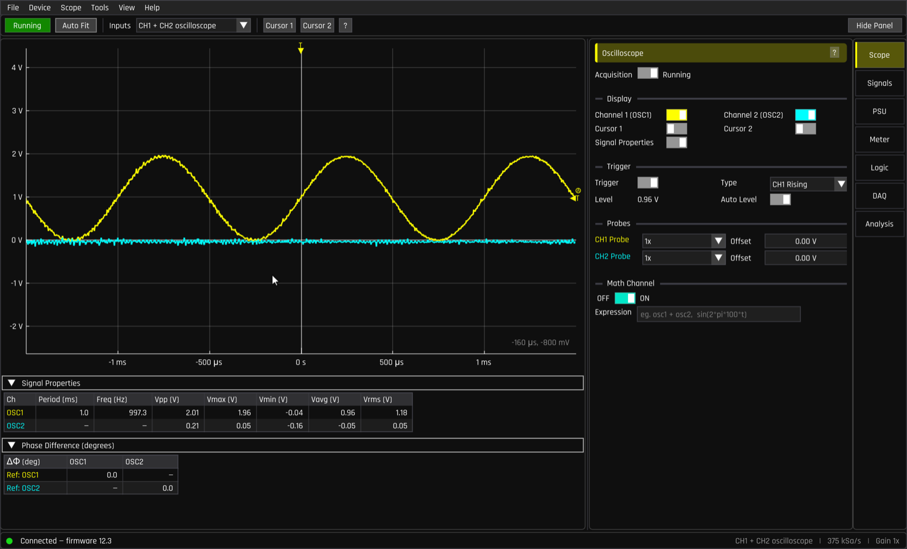

## Input modes and the two-buffer rule

The **Inputs** dropdown in the toolbar (also `Device → Input Mode`) selects
what the hardware samples:

1. **CH1 + CH2 oscilloscope** (default) — both analog channels at 375 kSa/s
2. **CH1 oscilloscope** — one channel, 12-bit samples
3. **CH1 oscilloscope, 750 kSps** — one channel, double sample rate
4. **CH1 oscilloscope + CH2 logic** — mixed analog + digital
5. **CH1 logic** — one digital channel
6. **CH1 + CH2 logic** — two digital channels (required for I²C decoding)
7. **Multimeter (CH1)** — the high-resolution voltmeter mode

Why modes at all? The board has **two buffer resources**: a 375 kSa/s scope
channel costs one, the 750 kSa/s mode costs two, the multimeter costs two.
You can't run everything at once; picking a mode is how you spend the budget.
The Meter and Logic pages offer one-click buttons to switch into the mode
they need.

## Page 1 — Scope (Oscilloscope)

Controls for *how you look at* signals.

* **Acquisition** — Running/Paused, same as the toolbar button and `Space`.
  Pausing freezes the record device-side; you can still zoom and pan through
  the frozen capture in full detail.
* **Display** — show/hide Channel 1 (OSC1) / Channel 2 (OSC2) (`C` / `V`),
  the two cursors, and Signal Properties.
* **Trigger** — on/off, **Type** (`CH1 Rising`, `CH1 Falling`, `CH2 Rising`,
  `CH2 Falling`), **Level** in volts, and **Auto Level** (tracks the signal's
  midpoint automatically — leave it on until you have a reason not to).
  The trigger is what makes a repeating wave stand still: each sweep starts
  when the chosen channel crosses the level in the chosen direction.
* **Probes** — per-channel attenuation (**1x / 5x / 10x**) if you use divider
  probes, and a display **Offset** to separate overlapping traces visually.
* **Math Channel** — a third trace computed from an expression. Variables
  `osc1`, `osc2` and `t`; e.g. `osc1 - osc2` (differential measurement) or
  `sin(2*pi*100*t)` (reference wave). A green ✔ means the expression parses.
* **Hardware Gain** (`Scope → Hardware Gain`, or `Up`/`Down` keys) — the
  analog input range, 0.5× to 64×. Higher gain = smaller range = more detail.
  **Auto** picks it for you; the current gain shows in the status bar.

`Scope → XY Mode` plots CH1 against CH2 (component curves, Lissajous
figures). `Scope → Eye Diagram` overlays trigger-aligned sweeps — a classic
way to judge digital signal quality (needs the trigger enabled).

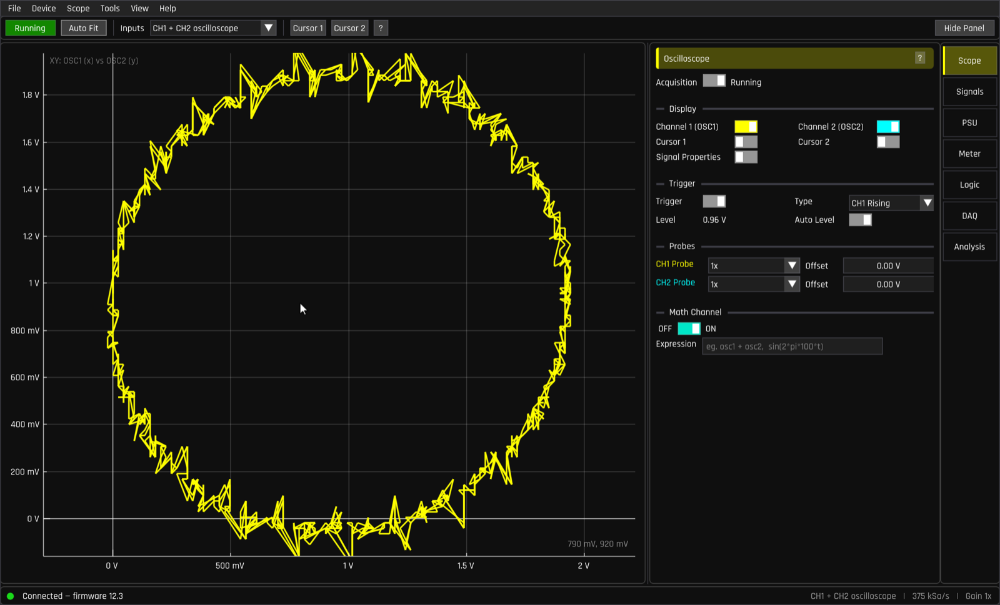

## Page 2 — Signals (Signal Outputs)

Controls for *making* signals: two independent generators and four digital
outputs.

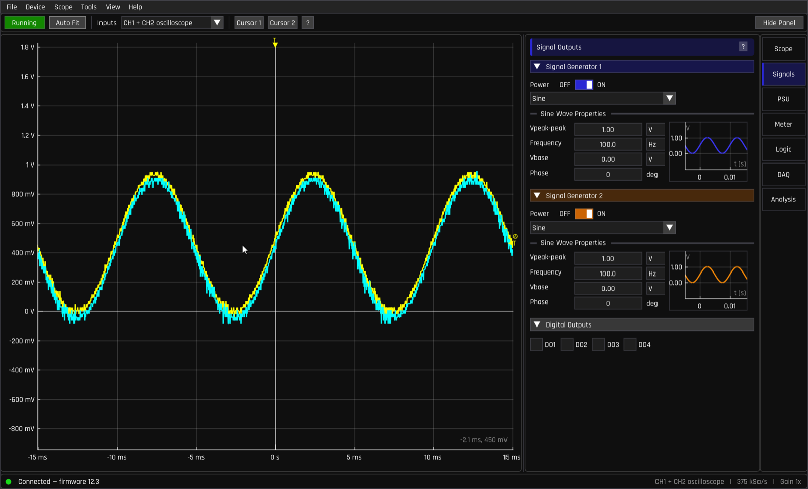

Per generator:

* **Power** ON/OFF and a waveform picker — **Sine, Square, Sawtooth,
  Triangle**, plus arbitrary waveforms (**DC**, **PRBS5**) loaded from
  `.tlw` files.
* **Vpeak-peak** — amplitude, 0.15–9 V.
* **Frequency** — 1 Hz to 1 MHz. (The wave is built from up to 512 samples
  played at up to 1 MSa/s, so very high frequencies have fewer points per
  cycle.)
* **Vbase** — the voltage of the wave's **lowest point** (not its average!).
  Vbase 0 with 2 Vpp gives a wave from 0 V to 2 V.
* **Phase** (0–360°) and, for Square, **Duty Cycle**.

Notes:

* Drag a value to adjust it; double-click to type it.
* The output ceiling follows the power supply: peak output ≈ PSU voltage
  − 1.2 V. If your amplitude is being clamped, raise the PSU voltage.
* **Digital Outputs** — four checkboxes (DO1–DO4) driving the 3.3 V digital
  output pins. They power up low.
* **UART TX** lives on the Logic page (see below) and can take over SG1's
  output pin to transmit serial data.

## Page 3 — PSU (Power Supply)

One slider: **4.5–11 V** onto the *Power Supply (Positive)* pin, up to
0.75 W. Use it to power the circuit you're probing.

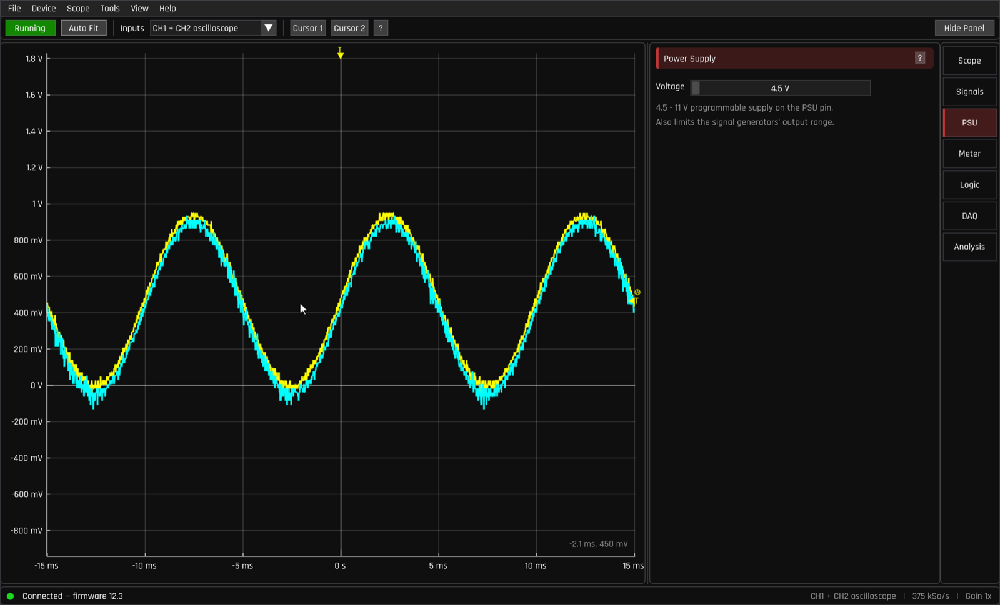

The setting deliberately resets to 4.5 V every time the app starts, so a
forgotten 11 V setting can't surprise the next circuit you plug in. Remember
the ripple is not lab-grade (±hundreds of mV under load) — fine for powering
logic and LEDs, not a precision reference.

## Page 4 — Meter (Multimeter)

The multimeter reuses the scope hardware in a high-resolution (12-bit) mode,
measuring **between** the DUT+ (= OSC CH1) and DUT− (= OSC CH2) pins — the
*duplicate* scope pins on the board exist exactly for this. Because it costs
both buffer resources, the app asks to switch modes:

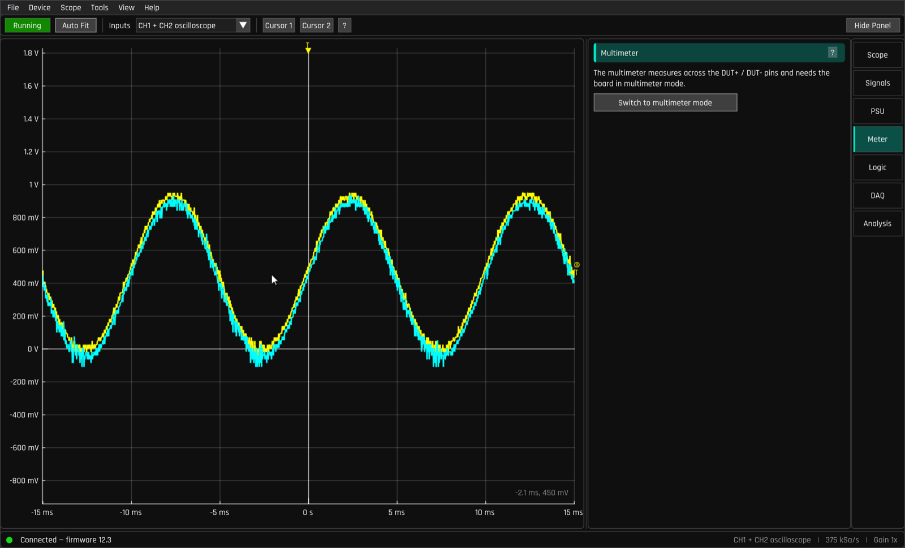

* **Voltage** — probe DUT+ / DUT− across anything; reads Max / Min / Mean /
  RMS. Range ±20 V.
* **Current** — insert a known series ("shunt") resistor in the current path
  and probe across it; enter its value as **Series R**. Pick a shunt that
  drops at least ~50 mV but no more than ~10 % of the supply.
* **Resistance** — the board drives the unknown through your reference
  resistor (from **Signal Gen CH2** at 3.0 V DC, or from the **Power
  Supply** at 5 V — the panel shows the exact wiring for each choice).
  Accuracy is best when the reference is close to the unknown.
* **Capacitance** — SG CH2 drives a 4 Hz square wave through your series
  resistor into the capacitor; pick the resistor so R·C is around 1 ms.

**Pause** freezes the readings. **Leave multimeter mode** returns to the
scope.

## Page 5 — Logic (Logic Analyzer)

Decodes digital traffic on the two **Logic Analyzer** pins (3 MSa/s each,
3.3/5/12 V tolerant). Needs a channel in logic mode — the page offers
**CH1 scope + CH2 logic** and **CH1 + CH2 logic (I2C)** shortcuts.

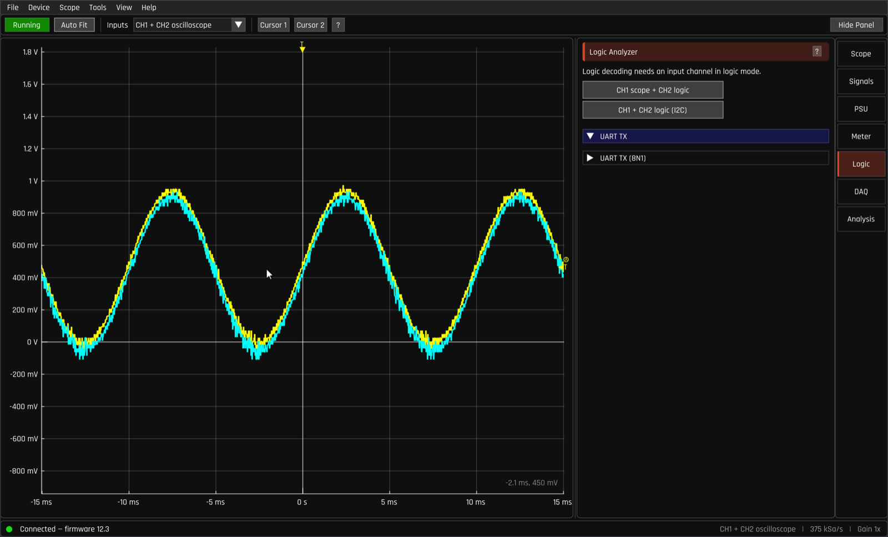

* **UART** — per-channel decode console with baud rates 300–115200, parity
  None/Even/Odd, ASCII or Baudot charsets, hex display, and a parity-error
  indicator.
* **I²C** *(beta)* — needs both channels in logic mode; SDA = CH1, SCL = CH2.
* **UART TX** — transmit serial *out* of the board: tick **Drive CH1 as UART
  line**, pick the baud rate and TX level (0.5–9 V, default 3.3 V), type a
  message, **Send**. Great for exercising a microcontroller's serial input —
  or loop it back into the logic analyzer to watch a UART frame bit by bit.

## Page 6 — DAQ (Data Acquisition)

Records raw samples to a file, and replays recordings.

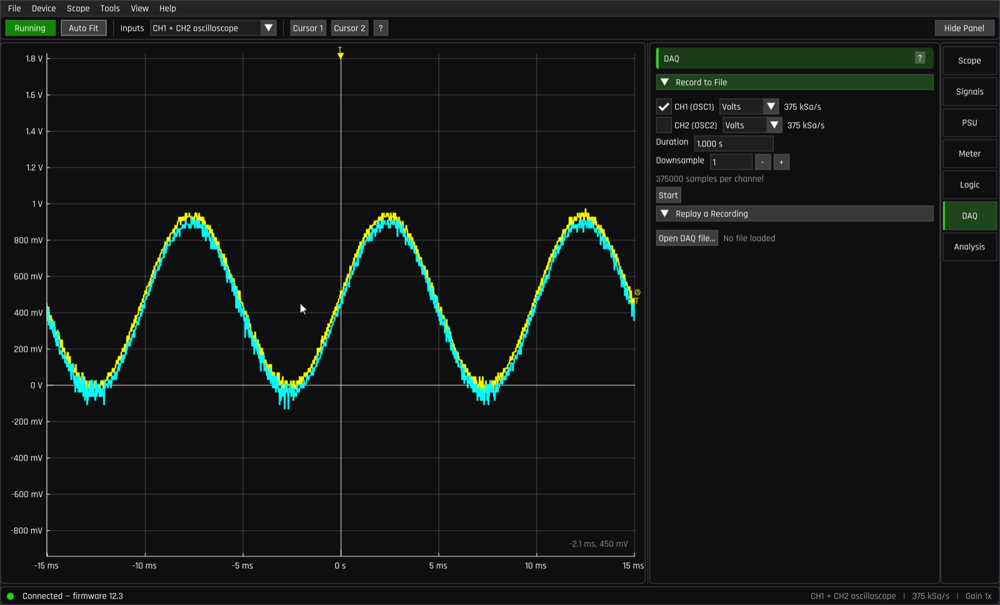

* **Record to File** — choose channels and units (Volts/Bits), an optional
  **Downsample** factor, and a **Duration** up to 10 s (the device buffer's
  depth), then **Start** and pick a `.txt` file.
* **Replay a Recording** — **Open DAQ file…** loads a recording into its own
  plot with trim handles (**Start/End**), a real-time axis option, and
  **Export trimmed CSV…** for taking data into Python/Excel/MATLAB.

For quick exports of what's currently on screen, use `File → Export`
(OSC1/OSC2/Math as CSV, spectra, network-analysis results) or the export
rows on the instrument pages — these can also copy straight to the clipboard
in spreadsheet-friendly form.

## Page 7 — Analysis (Analysis Tools)

Two frequency-domain tools; the master OFF/ON switch replaces the main plot
with the active tab's display.

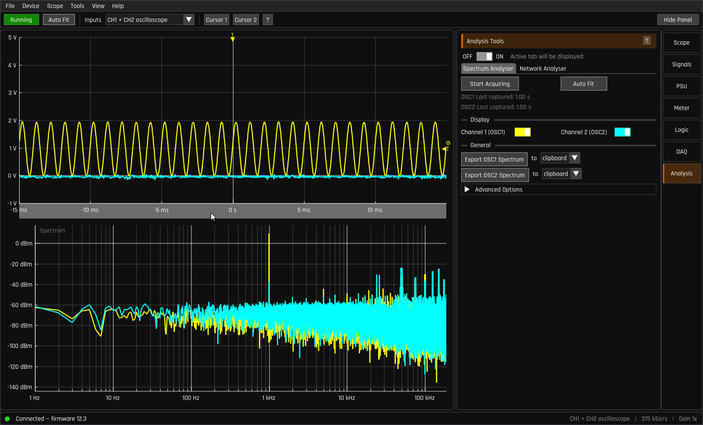

* **Spectrum Analyser** — an FFT of the incoming signal: signal strength
  versus frequency. **Start Acquiring** captures a window (1 s by default)
  and displays its spectrum; Advanced Options set the sample rate, window
  length, windowing function (Hann/Rectangular), units (dBm/dBV/V RMS) and
  a continuous **Lookback** mode.
* **Network Analyser** — measures a circuit's **frequency response** (gain
  and phase versus frequency) automatically: it steps a stimulus generator
  (SG1 or SG2) across a frequency range (1–5000 Hz), measures input and
  output on the two scope channels, and plots gain in dB (and phase).
  Perfect for characterising filters — wire the stimulus and the reference
  channel to the filter input, the response channel to its output, and press
  **Acquire**.

## Themes, layouts, text size

`View → Theme` offers Classic Dark (default) and Classic Light, plus six CRT
homages — Phosphor/Amber/Vector in Retro (pixel-font) and Modern variants,
with an optional scanline overlay:

| | |
|---|---|
| 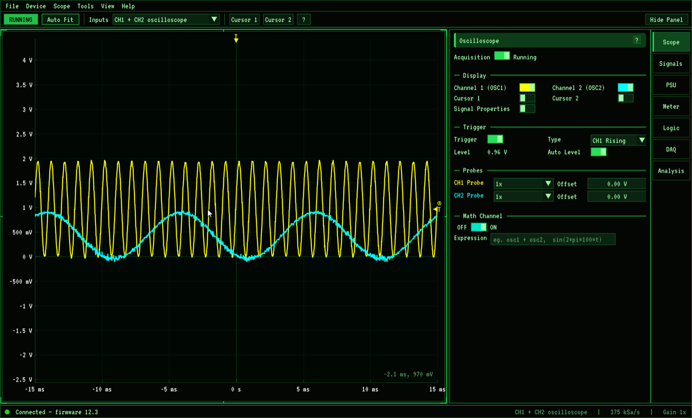 | 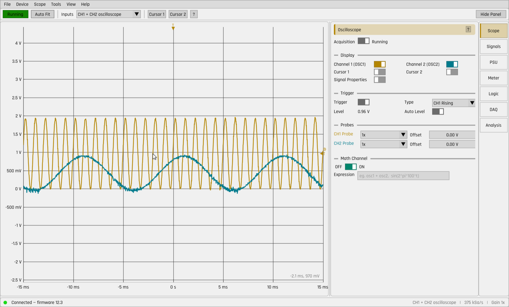 |

`View → Text Size` scales the whole UI (Small → Extra Large).
`View → Layout` switches between Desktop, Tablet, Mobile, and the
touch-native **Compact** layout for small screens:

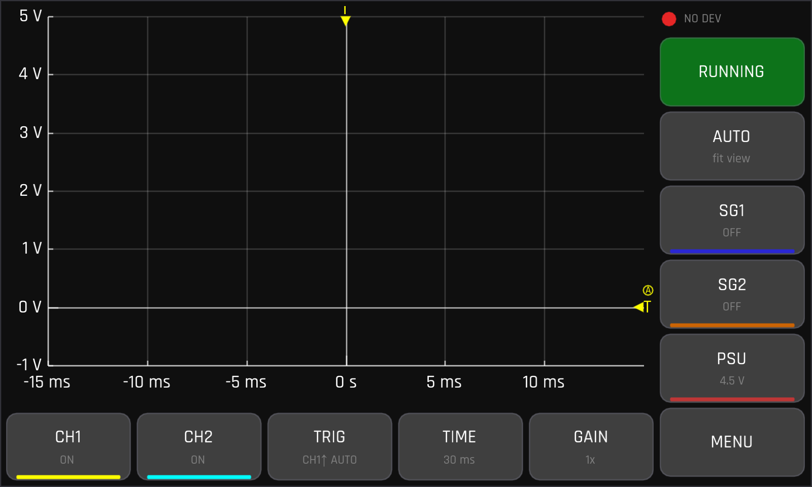

## Keyboard shortcuts

Press `F1` any time for this list in-app. On macOS, `Cmd` works where `Ctrl`
is shown.

| Key | Action |
|---|---|
| `Space` | Run / Stop acquisition |
| `F` | Auto-fit both axes |
| `Up` / `W` | Increase gain (smaller range) |
| `Down` / `S` | Decrease gain (larger range) |
| `1` / `2` | Toggle cursor 1 / 2 |
| `C` / `V` | Show / hide channel 1 / 2 |
| `B` | Show / hide the side panel |
| `Esc` | Reset the USB connection |
| `F1` | Keyboard shortcuts help |

## Calibration

`Device → Calibration…` runs two short guided wizards. Do this once when you
get your board (and again if readings look offset):

* **Calibrate Oscilloscope** — step 1: disconnect everything from CH1 and
  CH2; step 2: connect both channels to ground (the metal shield of the USB
  connector works). Each step measures for a second or two.
* **Calibrate PSU** — connect OSC CH1 (DC) to the Power Supply (Positive)
  pin; the wizard measures the supply at two setpoints and stores the offset.

Results are saved to the board and to your settings, and survive restarts.

## Files and settings

* **Waveform/CSV exports** — 2-column CSV (or clipboard) from `File → Export`
  and the per-widget export rows.
* **DAQ recordings** — plain text, one line of samples per channel; replay
  in-app or post-process anywhere.
* **Custom waveforms** — `.tlw` files (up to 512 samples, values 0–255) in
  the app's `waveforms` folder; add the filename to `_list.wfl` to make it
  appear in the waveform picker.
* **Settings** — stored in `settings.ini` under your platform's app-data
  directory (macOS: `~/Library/Application Support/EspoTek/Labrador/`;
  Windows: `%APPDATA%\EspoTek\Labrador\`; Linux:
  `~/.local/share/EspoTek/Labrador/`). Theme, layout, gain and calibration
  persist; the PSU voltage intentionally does not.
